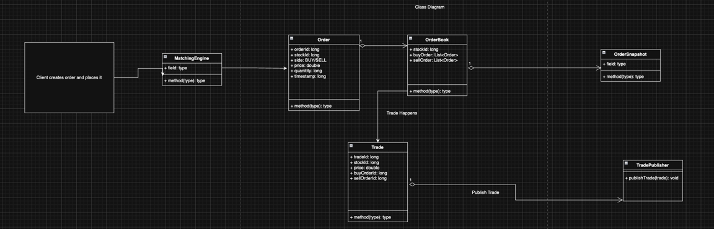

# Approaching the solution

## Derivation of entities from given data (Core Entities)

- Need to place/modify/cancel an order : ORDER
- For each stock, there will be an order book, that will hold active orders of that stock: ORDER_BOOK
- Any match of BUY and SELL creates a trade : TRADE
- A trade needs to be published : TRADE_PUBLISHER
- For each stock, it's own order book is maintained, to support multiple stocks concurrently, need a central system: MatchingEngine.
- MatchingEngine will hold a mapping of stock to OrderBook.


## Core Algorithm (Trying to achieve what?)

```text
Every time an order is PLACED:

    1. Insert it into OrderBook (data structure = priority queue / CAS list)

    2. Try to MATCH it:

        WHILE (best BUY price >= best SELL price)
            - Execute trade
            - Reduce quantities
            - Remove order if fully filled
            - Publish TRADE

Every time an order is CANCELLED:

    - Remove from OrderBook (lookup by orderId)

Every time an order is MODIFIED:

    - Remove old version
    - Insert updated version
    - Try to match again

```


## Flow of Data

```text
Client → MatchingEngine → OrderBook → TradePublisher
                          ↑            ↓
                       modifies       publishes Trade

Client → Snapshot API → OrderBook → builds OrderSnapshot

```


## Class Diagram

